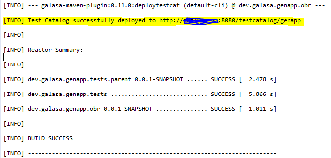

# IBM Z Application Continuous Testing using Galasa
IBM Z is home to many mission critical applications as it offers unmatched quality of services including security, availability, reliability, and scalability. DevOps is a thriving practice in IBM Z that focuses on shortening the software development life cycle and ensuring continuous integration, continuous testing, and continuous delivery. Continuous testing for IBM Z applications is one of the areas that lags compared to distributed platform/cloud applications. 

Multiple testing tools are available in market for IBM Z applications. [Galasa framework](https://galasa.dev/) is one of a kind that allow integration testing across platforms and technologies in a DevOps pipeline. Galasa can be easily integrated with multiple platforms like IBM Z, distributed/cloud-native throughout the enterprise. This allows Galasa to do end-to-end tests of applications that run on multiple platforms.  

This tutorial focuses on how to use Galasa framework to do application testing automation for IBM Z applications.  You will learn how to setup an Galasa Ecosystem, integrate Eclipse and Jenkins with Galasa Ecosystem and run IBM Z app Galasa test cases in Galasa Ecosystem from Eclipse and from Jenkins pipeline.  The sample application used for this tutorial is GenApp, which is a z/OS CICS–DB2 application.  

## Pre-requisites

### Software Requirements:
* [Docker Engine](https://docs.docker.com/engine/): Install on Linux, Windows or MacOS. If using a Mac or Windows OS, you will need Docker Desktop running a "socat" container.
* [Jenkins](https://www.jenkins.io/): For test case execution orchestration. Jenkins instance will be deployed along with Galasa Ecosystem. However, you can use your Enterprise Jenkins instance as well.
* [Eclipse IDE](https://www.eclipse.org/): Install Galasa plugin in the Eclipse IDE. The detailed steps involved in Galasa plugin install is provided later in this tutorial.
* [Nexus Repository](https://www.sonatype.com/products/repository-pro): To store the Galasa test case bundles. Nexus instance will be deployed along with Galasa Ecosystem. However, you can use your Enterprise Nexus instance as well.

### Hardware Requirements:
* Galasa Ecosystem require minimum 4 GB memory

### Ports required for Galasa Ecosystem:
* 2379 - etcd
* 5984 - CouchDB
* 8080 - API
* 8081 - Nexus
* 8082 – Jenkins

**Note**: The demo test cases in this tutorial are written for the z/OS CICS sample application – GENAPP.  The sample application can be downloaded and installed from - [CB12: General insurance application (GENAPP) for IBM CICS TS](https://www.ibm.com/support/pages/cb12-general-insurance-application-genapp-ibm-cics-ts)

## Estimated time 
It is expected to take about 150 minutes to install the Galasa Ecosystem, configure Eclipse and Jenkins. 
It is expected to take about 60 minutes to install the GenApp sample application if it is not already installed.  

## Steps
Here are the steps needed to set up the Galasa Ecosystem and to integrate Eclipse and Jenkins with Galasa Ecosystem to execute the Galasa test cases. 

* [Step 1. Galasa Ecosystem installation using Docker image](#step-1-galasa-ecosystem-installation-using-docker-image)
* [Step 2. Verifying Galasa Ecosystem installation](#step-2-verifying-galasa-ecosystem-installation)
* [Step 3. Galasa Ecosystem Jenkins plugin](#step-3-galasa-ecosystem-jenkins-plugin)
* [Step 4. Galasa Ecosystem integration with Eclipse](#step-4-galasa-ecosystem-integration-with-eclipse)
* [Step 5. How to Create a Galasa project?](#step-5-how-to-create-a-galasa-project)
* [Step 6. Create and build Galasa test cases](#step-6-create-and-build-galasa-test-cases)
* [Step 7. Deploy Galasa Test Maven Artifacts to Nexus Repository and add to API Server in Ecosystem](#step-7-deploy-galasa-test-maven-artifacts-to-nexus-repository-and-add-to-api-server-in-ecosystem)
* [Step 8. Editing the CPS](#step-8-editing-the-cps)
* [Step 9. Execute Galasa test automation from Eclipse](#step-9-execute-galasa-test-automation-from-eclipse)
* [Step 10. Execute Galasa test from Jenkins](#step-10-execute-galasa-test-from-jenkins)
* [Step 11. Execute Galasa test from Local](#step-11-execute-galasa-test-from-local)

### [Step 1. Galasa Ecosystem installation using Docker image](#steps)
Create the config.yaml file in the server where Ecosystem needs to be installed. Refer [config.yaml](./sample/config.yaml).

Update the ```{hostname}``` with the host name of the server. Update the latest version, controllerVersion and engineVersion by referring Docker Hub - [galasadev/galasa-docker-operator-amd64 Tags](https://hub.docker.com/r/galasadev/galasa-docker-operator-amd64/tags?page=1&ordering=last_updated).

```
hostname: {hostname}
galasaRegistry: docker.galasa.dev
version: 0.14.0
engineController:
  controllerVersion: 0.14.0
  engineVersion: 0.14.0
```

To deploy Galasa ecosystem issue the following Docker command. Update ```{path}``` to the path where config.yaml file is located. Update the version - ```0.14.0``` to the version used in the config.yaml.

```
sudo docker run -it -v /var/run/docker.sock:/var/run/docker.sock -v {path}/Galasa/config.yaml:/config.yaml docker.galasa.dev/galasa-docker-operator-amd64:0.14.0
```

### [Step 2. Verifying Galasa Ecosystem installation](#steps)  
Issue the Docker command - ```sudo docker container ls``` and see if all the below mentioned containers are up and running.

Refer [container_list.log](./sample/container_list.log).

```
IMAGE                                                 NAMES
docker.galasa.dev/galasa-boot-embedded-amd64:0.14.0   galasa_simplatform
jenkins/jenkins:2.243                                 galasa_jenkins
sonatype/nexus3:3.24.0                                galasa_nexus
docker.galasa.dev/galasa-boot-embedded-amd64:0.14.0   galasa_engine_controller
docker.galasa.dev/galasa-boot-embedded-amd64:0.14.0   galasa_metrics
docker.galasa.dev/galasa-boot-embedded-amd64:0.14.0   galasa_resource_management
docker.galasa.dev/galasa-boot-embedded-amd64:0.14.0   galasa_api
couchdb:2.3.1                                         galasa_ras
quay.io/coreos/etcd:v3.4.9                            galasa_cps
```

Go to  ```http://{hostname}:8081``` and check if Nexus repository is up and running.  Default credential is user: ```admin``` and password: ```galasaadmin```.
Go to  ```http://{hostname}:8082``` and check if Jenkins is up and running.  Default credential is user: ```admin``` and password: ```galasaadmin```.

### [Step 3. Galasa Ecosystem Jenkins plugin](#steps) 
To use a different Jenkins instance to integrate with Galasa Ecosystem, install the Galasa Jenkins plugin downloaded from - [Index of / (galasa.dev)](https://resources.galasa.dev/).\
\
**Configure Galasa in Jenkins**:\
Go to Manage Jenkins → Configuration → Galasa Configuration → Galasa API Server URL → ```http://{hostname}:8080/```. Provide dummy credentials in Galasa Credentials. Currently the API server doesn’t need authentication, the credentials box is a placeholder for the time being and will be updated in future releases.


### [Step 4. Galasa Ecosystem integration with Eclipse](#steps)  
Install Galasa plugin in Eclipse:
* Launch Eclipse. If present, close any initial welcome screen.
* Choose Help > Install New Software from the main menu.
* Paste https://p2.galasa.dev/ into the Work with field and press Enter.
* Tick the Galasa box in the main panel, ensuring that Galasa and all its child elements are ticked.
* Follow the prompts to download and install the Galasa plug-in. Accept the terms of the license agreement and restart Eclipse to complete the installation. Acknowledge and agree that you are installing unsigned content.

Verify the installation and configuration by following the steps mentioned in - [Installing the Galasa plug-in](https://galasa.dev/docs/getting-started/installing/). Galasa Plugin provides a demo application called SimBank that simulates a mainframe application and few demo Galasa testcases for SimBank application. Refer [Exploring Galasa SimBank](https://galasa.dev/docs/getting-started/simbank) and [Running the supplied SimBank tests](https://galasa.dev/docs/running-simbank-tests).

By default, the Galasa test results will be stored in the local machine in folder - ```~/.galasa/ras```.

To store the test results to RAS CouchDB which is part of Galasa ecosystem modify the following in Eclipse preferences. Eclipse → Window → Preferences → Galasa → Bootstrap URI → ```http://{hostname}:8080/bootstrap```.


Using Eclipse, we can run the Galasa test cases from local and also run headlessly in Galasa Ecosystem. To run Galasa test cases from ecosystem headlessly the Bootstrap URI should be updated to point to Galasa Ecosystem as mentioned above.  After configuring the bootstrap URI, the local runs will run using the ecosystems configurations (which can then be overridden using the overrides.properties). This makes it easier for team wide configurations to stay consistent.

### [Step 5. How to Create a Galasa project?](#steps)
Create a parent Maven project. Inside parent project create Maven Module tests project for the test cases and OSGi Bundle Repository(OBR) Maven Module project to generate OBR.  The project structure looks like as follows:

```
├───dev.galasa.genapp.tests.parent
│   │   pom.xml
│   ├───dev.galasa.genapp.obr
│   │       pom.xml
│   └───dev.galasa.genapp.tests
│       │   pom.xml
│       └───src
```

**Create parent project**:\
From Eclipse Menu → File →Other → Maven Project.\
\
The parent project pom.xml file of looks like [./dev.galasa.genapp.tests.parent/pom.xml](./dev.galasa.genapp.tests.parent/pom.xml).  Note that the packaging should be ```pom```.  Modify the ```groupId```, ```artifactId```, ```version```, ```name``` and ```modules``` as per the project.  Modify the dependencies based on the Galasa managers required for the test cases.  Add ```bundletestcat``` goal as shown in the sample ```pom.xml```.


Select Maven Project and provide the requested details to create the project.


**Create tests project**:\
From Eclipse Package Explorer view right click on the parent project → New → Other → Maven module.\
\
The tests project ```pom.xml``` files looks like [./dev.galasa.genapp.tests.parent/dev.galasa.genapp.tests/pom.xml](./dev.galasa.genapp.tests.parent/dev.galasa.genapp.tests/pom.xml). The packaging should be ```bundle```.


Select Maven Module and provide the requested details to create the project.


**Create obr project**:\
From Eclipse Package Explorer view right click on the parent project → New → Other → Maven module.\
\
The OBR project pom.xml files looks like [./dev.galasa.genapp.tests.parent/dev.galasa.genapp.obr/pom.xml](./dev.galasa.genapp.tests.parent/dev.galasa.genapp.obr/pom.xml). The packaging should be ```galasa-obr```. Add dependency to artifactId of tests project created above.
**Note**: OBR project pom file may have errors saying that it is not covered by the lifecycle.

### [Step 6. Create and build Galasa test cases](#steps)
From Eclipse Package Explorer view right click on the Tests project → New → Class.


Refer the demo test classes [GenAppCustAddGeneralInsurance.java](./dev.galasa.genapp.tests.parent/dev.galasa.genapp.tests/src/main/java/dev/galasa/genapp/tests/GenAppCustAddGeneralInsurance.java) and [GenAppCustInquiryGeneralInsurance.java](./dev.galasa.genapp.tests.parent/dev.galasa.genapp.tests/src/main/java/dev/galasa/genapp/tests/GenAppCustInquiryGeneralInsurance.java). These test classes are written for sample z/OS CICS application [CB12: General insurance application (GENAPP) for IBM CICS TS](https://www.ibm.com/support/pages/cb12-general-insurance-application-genapp-ibm-cics-ts).

Build the test case from Eclipse Package Explorer view right click on the parent project → Run As → Maven Install. This will build the test case.


Verify the successful completion of build from the Eclipse Console view.


The build output – *testcatalog.json* will be created in the target folder under Tests and OBR projects.


### [Step 7. Deploy Galasa Test Maven Artifacts to Nexus Repository and add to API Server in Ecosystem](#steps)
Create *settings.xml* file in the local system where Eclipse is running.  Default path of *settings.xml* file is ```~/.m2```.  Refer sample [settings.xml](./sample/settings.xml). Update the following in *settings.xml* file:
* Update the Nexus server details – ```id```, ```username``` and ```password```
* Update the Nexus repository URL in release repo and snapshot repo under ```properties```, ```repositories``` and ```pluginRepositories```.  The release repo and snapshot repo variables will be used in [parent pom.xml](./dev.galasa.genapp.tests.parent/pom.xml) for defining distribution management.
* Update the test stream name and galasa ecosystem bootstrap url.  This test stream name will be defined in CPS in Galasa Ecosystem later in this tutorial. The test stream name used in this example is ```GENAPP```.

Update the distributionManagement details in parent project pom.xml file. Refer [./dev.galasa.genapp.tests.parent/pom.xml](./dev.galasa.genapp.tests.parent/pom.xml).

```
  <distributionManagement>
    	<repository>
    		<id>genapp</id>
    		<url>${genapp.release.repo}</url>
    	</repository>
    	<snapshotRepository>
    		<id>genapp</id>
    		<url>${genapp.snapshot.repo}</url>
    	</snapshotRepository>
  </distributionManagement>
```

Once the pom.xml file is updated build the parent project as mentioned in the previous step. From Eclipse Package Explorer view right click on the parent project → Run As → Maven Install. This will build the test case.


**Deploy the Galasa project in Nexus**:\
\
From Eclipse Menu → Run → Run configuration → Right click Maven Build → New configuration.\
\
Update Name, Base directory from Workspace, Goals as ```clean deploy```, profiles and settings.xml path in User settings. Apply and run the deploy.


Verify the deployment status from the Eclipse Console view.



Go to the deployment output details in the highlighted URL and verify the deployed artifacts.


Verify the project artifacts deployed in Nexus repo.


Next add the generated test catalog to the API server in Galasa ecosystem.  For this add a new goal - ```dev.galasa:galasa-maven-plugin:deploytestcat``` in Maven deploy as shown below. Apply and run the deploy.


Check out the API ```http://{hostname}:8080/testcatalog``` to see if the test catalog is added to API.


Verify the contents of the catalog using API ```http://{hostname}:8080/testcatalog/<stream name>```. Make a note of the packages mentioned here, which will be used in the Jenkins integration later in this tutorial.


### [Step 8. Editing the CPS](#steps)
Run the following docker command to interact with CPS container.

```
docker exec -it galasa_cps /bin/sh
```

Use etcdctl to add the override parameters. 

#### Defining the Test-Stream
* The parameter - ```framework.test.streams``` will have all the streams with comma separation. The test stream name used in this example is GENAPP as mentioned in [settings.xml](./sample/settings.xml). The stream name - ```GENAPP``` in the below mentioned sample commands needs updation as per the stream name and other existing stream names in the ecosystem.  All the existing stream names can be viewed by executing the command - ```etcdctl get "framework.test.streams"```.
* The ```obr```, ```repo``` and ```location``` urls needs to be updated as per the environment.
* The parameter ```framework.request.type.JENKINS.prefix``` is used to prefix the Galasa results when ran from Jenkins. This will help to identify if the test cases are run from Jenkins or not.

```
etcdctl put framework.test.streams GENAPP,{Comma separated existing streams}
etcdctl put framework.test.stream.GENAPP.repo http://XXX.XXX.XXX.XXX:8082/repository/genapp-test
etcdctl put framework.test.stream.GENAPP.obr mvn:dev.galasa/dev.galasa.genapp.obr/0.0.1-SNAPSHOT/obr
etcdctl put framework.test.stream.GENAPP.location http:// XXX.XXX.XXX.XXX:8080/testcatalog/genapp
etcdctl put framework.test.stream.GENAPP.description "GENAPP Test Stream"
etcdctl put framework.request.type.JENKINS.prefix "J"
```

#### Defining the Configurational Properties for the test environment
The image id used in sample test classes - [GenAppCustAddGeneralInsurance.java](./dev.galasa.genapp.tests.parent/dev.galasa.genapp.tests/src/main/java/dev/galasa/genapp/tests/GenAppCustAddGeneralInsurance.java) and [GenAppCustInquiryGeneralInsurance.java](./dev.galasa.genapp.tests.parent/dev.galasa.genapp.tests/src/main/java/dev/galasa/genapp/tests/GenAppCustInquiryGeneralInsurance.java) is ZDNT. Define all the parameters required for the image id ZDNT in the CPS server using the following etcdctl commands. Wherever ZDNT is mentioned in the below commands needs to be updated with the image ID.  The *host IP*, *telnet/ssh/zosmf ports*, *userid* and *password* mentioned below needs to be updated according to the environment.

```
etcdctl put "zos.dse.tag.ZDNT.imageid" "ZDNT"
etcdctl put "zos.dse.tag.ZDNT.clusterid" "ZDNT"
etcdctl put "zdnt.dse.instance.name" "ZDNT"
etcdctl put "zdnt.instance.ZDNT.zos.image" "ZDNT"
etcdctl put "zos.image.ZDNT.ipv4.hostname" "XXX.XXX.XXX.XXX"
etcdctl put "zos.image.ZDNT.telnet.port" "23"
etcdctl put "zos.image.ZDNT.ssh.port" "22"
etcdctl put "zos.image.ZDNT.telnet.tls" "false"
etcdctl put "zos.image.ZDNT.credentials" "ZDNT"
etcdctl put "zosmf.image.ZDNT.servers" "ZDNT"
etcdctl put "zosmf.server.ZDNT.credentials" "ZDNT"
etcdctl put "zosmf.server.ZDNT.image" "ZDNT"
etcdctl put "zosmf.server.ZDNT.port" "443"
etcdctl put "zosmf.server.ZDNT.https" "true"
etcdctl put "secure.credentials.ZDNT.username" "{username}"
etcdctl put "secure.credentials.ZDNT.password" "{password}"
```

Verify all the CPS variables definition using the command:

```etcdctl get --prefix=true ""```

### [Step 9. Execute Galasa test automation from Eclipse](#steps)
Make sure that the Bootstrap URI in Eclipse preferences is updated as mentioned in [Step 4. Galasa Ecosystem integration with Eclipse](#step-4-galasa-ecosystem-integration-with-eclipse). Initialise Galasa framework if not already done from Eclipse menu → Galasa → Initialise Galasa Framework.


Submit test case from Eclipse menu → Galasa → Submit test to automation.  


Select the test case and run it.


Go to Galasa Results view and see the Galasa test results.\
\
To view Galasa Results: Eclipse menu → Window → Show View → Galasa Results


Double click the test results to open it. Explore the detailed run log and artifacts tabs.


### [Step 10. Execute Galasa test from Jenkins](#steps) 
Create a new Jenkins pipeline job by clicking new item from the Jenkins main menu.


Create a new pipeline script. Refer [Jenkinsfile](./sample/Jenkinsfile). Save and close.


Run the job by clicking Build now from the Jenkins job menu.


Get the Galasa run ID from Jenkins console log. The Galasa test logs is stored in CPS CouchDB and can be viewed in detail from Eclipse IDE.


Click on the Test Schedule endpoint in the Jenkins job console log to know the status of test execution.


View the detailed Galasa results from Eclipse using the Run ID from the Jenkins console log. In this example it is J18 and J19.


Double click the test results to open it. Explore the detailed run log and artifacts tabs.


### [Step 11. Execute Galasa test from Local](#steps)
Galasa test cases can be executed locally from Eclipse using ecosystem configurations.  This will address the common challenge of debugging the test case with breakpoints during a test failure.  

Note: To execute Galasa test cases from local, the test case should be build as mentioned in [Step 6. Create and build Galasa test cases](#step-6-create-and-build-galasa-test-cases). 

From Eclipse Main Menu → Run → Run Configurations. If the ```Run Configurations``` option is missing, then go to Eclipse Main Menu → Window → Perspective → Customize Perspective → Menu Visibility → Run → Select Run Configuration.


From ```Run configurations``` right click on ```Galasa-Java``` and select ```New configuration```.


Update the ```Project``` as the test project and ```Test class``` with the test case to run.  Update the ```Name``` of the new configuration.  Click ```Apply``` and ```Run``` to execute the test case from local.


View the execution log in the Eclipse ```Console``` view as shown below.


View the test results in ```Galasa Results``` view.  Double click on the test result to explore in detail. Explore the ```Run log``` and ```Stored artifacts``` tabs in the test results.


## Summary 
This tutorial helped you to understand how to setup Galasa Ecosyetm and integrate Galasa test case in Jenkins CI-CD pipeline. There are many more to come in Galasa which will be seen in future releases, one of which is the integration with [IBM Z Virtual Test Platform](https://www.ibm.com/products/z-virtual-test-platform) which is one of its kind and a game changer in IBM Z app shift-left testing. With the introduction of IBM Z Virtual Test Platform interface, Galasa will support shift left testing for both z/OS online and batch applications from the DevOps pipeline. 

Galasa reference:  
[Introduction | Galasa ](https://galasa.dev/docs)\
[Overview (galasa-uber-javadoc 0.14.0 API) ](https://javadoc.galasa.dev/overview-summary.html)